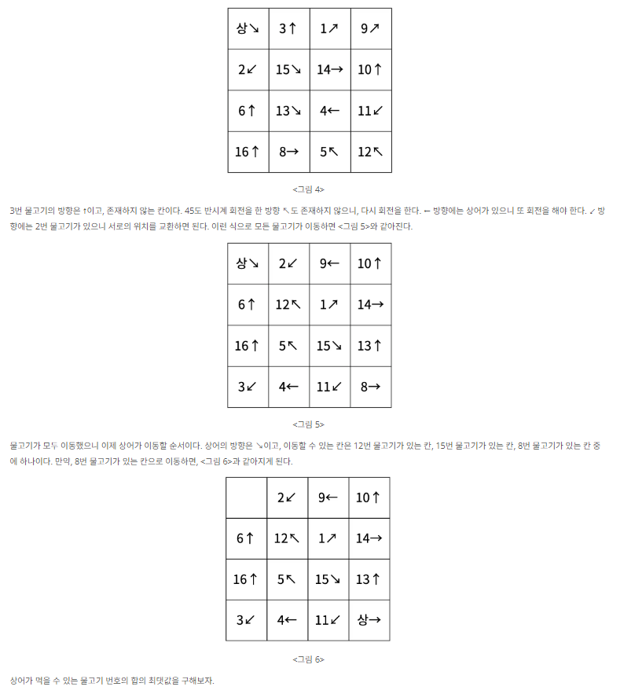

# BOJ_19236.청소년상어

출처: https://www.acmicpc.net/problem/19236

---
시간 제한	메모리 제한	제출	정답	맞힌 사람	정답 비율   
1 초 (추가 시간 없음)	512 MB	13220	8391	5407	65.436%

## 문제
아기 상어가 성장해 청소년 상어가 되었다.

4×4크기의 공간이 있고, 크기가 1×1인 정사각형 칸으로 나누어져 있다. 공간의 각 칸은 (x, y)와 같이 표현하며, x는 행의 번호, y는 열의 번호이다. 한 칸에는 물고기가 한 마리 존재한다. 각 물고기는 번호와 방향을 가지고 있다. 번호는 1보다 크거나 같고, 16보다 작거나 같은 자연수이며, 두 물고기가 같은 번호를 갖는 경우는 없다. 방향은 8가지 방향(상하좌우, 대각선) 중 하나이다.

오늘은 청소년 상어가 이 공간에 들어가 물고기를 먹으려고 한다. 청소년 상어는 (0, 0)에 있는 물고기를 먹고, (0, 0)에 들어가게 된다. 상어의 방향은 (0, 0)에 있던 물고기의 방향과 같다. 이후 물고기가 이동한다.

물고기는 번호가 작은 물고기부터 순서대로 이동한다. 물고기는 한 칸을 이동할 수 있고, 이동할 수 있는 칸은 빈 칸과 다른 물고기가 있는 칸, 이동할 수 없는 칸은 상어가 있거나, 공간의 경계를 넘는 칸이다. 각 물고기는 방향이 이동할 수 있는 칸을 향할 때까지 방향을 45도 반시계 회전시킨다. 만약, 이동할 수 있는 칸이 없으면 이동을 하지 않는다. 그 외의 경우에는 그 칸으로 이동을 한다. 물고기가 다른 물고기가 있는 칸으로 이동할 때는 서로의 위치를 바꾸는 방식으로 이동한다.

물고기의 이동이 모두 끝나면 상어가 이동한다. 상어는 방향에 있는 칸으로 이동할 수 있는데, 한 번에 여러 개의 칸을 이동할 수 있다. 상어가 물고기가 있는 칸으로 이동했다면, 그 칸에 있는 물고기를 먹고, 그 물고기의 방향을 가지게 된다. 이동하는 중에 지나가는 칸에 있는 물고기는 먹지 않는다. 물고기가 없는 칸으로는 이동할 수 없다. 상어가 이동할 수 있는 칸이 없으면 공간에서 벗어나 집으로 간다. 상어가 이동한 후에는 다시 물고기가 이동하며, 이후 이 과정이 계속해서 반복된다.

		





## 입력
첫째 줄부터 4개의 줄에 각 칸의 들어있는 물고기의 정보가 1번 행부터 순서대로 주어진다. 물고기의 정보는 두 정수 ai, bi로 이루어져 있고, ai는 물고기의 번호, bi는 방향을 의미한다. 방향 bi는 8보다 작거나 같은 자연수를 의미하고, 1부터 순서대로 ↑, ↖, ←, ↙, ↓, ↘, →, ↗ 를 의미한다.

## 출력
상어가 먹을 수 있는 물고기 번호의 합의 최댓값을 출력한다.

## 제한  
4 ≤ N ≤ 12  
4 ≤ K ≤ 10  
```
예제 입력 1   
7 6 2 3 15 6 9 8  
3 1 1 8 14 7 10 1  
6 1 13 6 4 3 11 4  
16 1 8 7 5 2 12 2  
예제 출력 1   
33   

```

# 느낀점
 빡센 구현 + DFS

